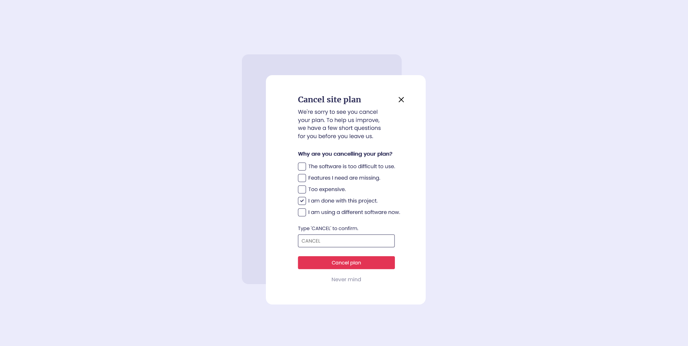

# Cancel-Plan-Modal
A quick exercise to practive css using a Figma mockup as reference

## Important to know
All the materials used on this mini-project come from a website called [UI Daily Desing](https://uidesigndaily.com/). The reference figma file was added to the project.

## Screenshot
Here is the final result

